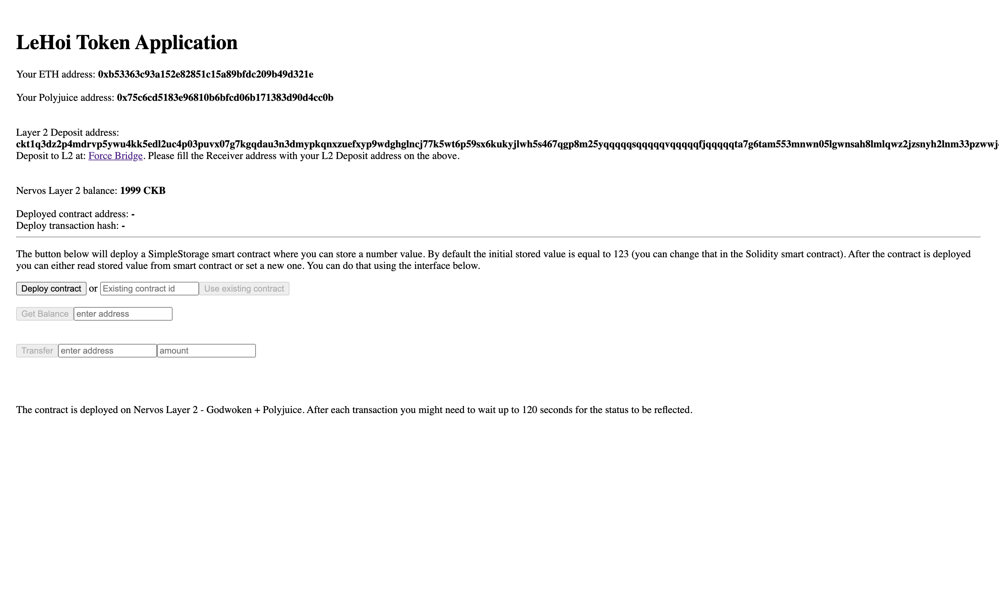

## Gitcoin: 8) Modify The Ported DApp So It Supports Ethereum Assets Via Force Bridge

## 1. A screenshot or video of your EVM application on Layer 2 with Force Bridge support.

[Video -- Layer 2 with Force Bridge support](https://vimeo.com/584956347)

Image

## 2. The address of the SUDT-ERC20 Proxy Contract that you deployed

`0x231369129f77590364D6e8EF9317274366Dd9AF2`

## 3. A link to the GitHub repository with your EVM application that integrates Force Bridge support.

[https://github.com/lehoi2195/blockchain-workshop/tree/task_8](https://github.com/lehoi2195/blockchain-workshop/tree/task_8)
